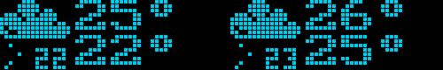

# PIS-OS

Personal Information System OS (formerly Plasma Information Screen OS).
(Not DOS, there is no disk in it! yet.)

A somewhat portable relatively-stylish pixel-art clock/weather station.


More photos in [the gallery](https://pis-os.genjit.su/index.html#photos)

## Available widgets

* Clock

    
    
* Indoor temperature

    
    
* Switchbot Meter temperature
* Weather (via [OpenWeatherMap](https://openweathermap.org/))
    
    

* Weather Forecast

    

* Hourly Precipitation and Pressure charts

    

* Weather Effect (raining and thunder on idle screen when rain/thunderstorm outside)
    
    

* Word of the Day (via [Wordnik](https://wordnik.com/))
    
    

* Foobar2000 (via [foo_controlverver](https://github.com/vladkorotnev/foo_controlserver/tree/fix-streams))
    
    
    
* Remaining sleep time (when using alarm app)
    
    

## Available apps

* Idle (home screen)
* Timer
    
    
    
* Stopwatch
    
    
* Alarm (Smart Wake Up on devices with motion sensor)
    
    
    
    
    
    *(blinking lights warning!)*
* Weighing Scale (via Wii Balance Board)
    
    
* Settings
    
    

## Available chime melodies

**(All chime tones are covers adapted for single channel beeper or 1-bit PIS-OS Sequencer by DJ AKASAKA)**

### Beeper tones

* Simple beep
* PC-98 Boot Chime
* Russ28 (Русь 28) Hourly Chime (poorly timed Beethoven's 5th Symphony)
* Some mid-2000s Shtrikh-M (Штрих-М) POS Boot chime
* [Caramell - Caramelldansen](https://youtu.be/o6Zp4cW8w8A?t=51): [MIDI](helper/chimes/caramelldansen.mid), [MP3 Recording](docs/rec/caramell.mp3)
* [BôA - Duvet](https://youtu.be/Uoox9fpmDP0) (simple version): [MIDI](helper/chimes/duvet.mid)
* [T-Square - Truth](https://youtu.be/FZaUPGjjA4c?t=77): [MIDI](helper/chimes/truth.mid)
* [Kosaki Satoru - Haruhi no Omoi](https://www.youtube.com/watch?v=KMKoyHKYSNk): [MIDI](helper/chimes/haruhi_no_omoi.mid)
* [WAVE and DRAX - When Present Is Past](https://modarchive.org/index.php?request=view_by_moduleid&query=140039): [MIDI](helper/chimes/when_present_is_past.mid)
* [Kawada Mami - Hishoku no Sora](https://www.youtube.com/watch?v=FNl1ud7KxtI): [MIDI](helper/chimes/hishoku.mid)
* [FEX — Subways Of Your Mind (Like The Wind / The Most Mysterious Song On The Internet)](https://www.youtube.com/watch?v=uYpkri8Kv2E): [MIDI](helper/chimes/like_the_wind.mid)
* [NightRadio - Waiting Freqs](https://www.youtube.com/watch?v=_0MBreuq94Y): [MIDI](helper/chimes/waiting_freqs.mid)
* [NightRadio - The Way](https://nightradio.bandcamp.com/track/the-way): [MIDI](helper/chimes/the_way.mid)
* [Dougal & Gammer — Guitar Hero](https://youtu.be/ID4pO9epHPA?t=89): [MIDI](helper/chimes/gtrhero.mid), [MP3 Recording](docs/rec/guitarhero.mp3)
* [蜂屋ななし — シャボン](https://youtu.be/UHRlXm_tV8o?t=41): [MIDI](helper/chimes/syabon.mid)
* [Takeshi Abo — Gate of Steiner](https://www.youtube.com/watch?v=2Q9MqL83FeE): [MIDI](helper/chimes/steiner.mid)
* [deadballP — 永遠に続く五線譜](https://www.youtube.com/watch?v=p1sh68qk4Nk): [MIDI](helper/chimes/towa.mid)
* [Cream puff — Mermaid girl](https://youtu.be/AaUMvgfHpUo?t=16): [MIDI](helper/chimes/mermgrl.mid)
* [Brisk & Trixxy — Eye Opener](https://youtu.be/81QqHUpyBhg?t=83): [MIDI](helper/chimes/eye_opener.mid), [MP3 Recording](docs/rec/eye_opener.mp3)

### 1-bit Polyphony

* [A.M. - Arise](https://youtu.be/cuOVP6pJ9Ww?t=264): [MIDI](helper/chimes/arise.mid), [MP3 Recording](docs/rec/arise.mp3)
* [Hirano Aya - Bouken Desho Desho](https://www.youtube.com/watch?v=C337shIT9LI): [MIDI](helper/chimes/bouken.mid)
* [Magome Togoshi, Shinji Orito - Gentle Jena](https://www.youtube.com/watch?v=lR4dw_B423E): [MIDI](helper/chimes/gentlejena.mid)
* [OMEGA - Gammapolisz](https://www.youtube.com/watch?v=XCqdrQxMrxI): [MIDI](helper/chimes/gammapolisz.mid)
* [Hiroyuki Oshima - The Ark Awakes From The Sea Of Chaos](https://www.youtube.com/watch?app=desktop&v=cB7eevDk1s0): [MIDI](helper/chimes/ark.mid), , [MP3 Recording](docs/rec/ark.mp3)
* [Timbaland - Give It To Me](https://youtube.com/watch?v=RgoiSJ23cSc) also known as [Skibidi Toilet](https://youtu.be/6dMjCa0nqK0): [MIDI](helper/chimes/skibidi_toilet.mid), [MP3 Recording](docs/rec/skibidi.mp3)
* [PinocchioP - God-ish (神っぽいな)](https://www.youtube.com/watch?v=EHBFKhLUVig): [MIDI](helper/chimes/kamippoina.mid), [MP3 Recording](docs/rec/kamippoina.mp3)
* [KOTOKO - Re-sublimity](https://youtu.be/QXDwb2rueYM?t=65): [MIDI](helper/chimes/resublimity.mid), [MP3 Recording](docs/rec/re_sublimity.mp3) - simple piano-ish score, better cover TBD?
* [Calvin Harris - Acceptable In The 80s](https://youtu.be/dOV5WXISM24?t=14): [MIDI](helper/chimes/inthe80s.mid)
* [emon - shake it!](https://www.youtube.com/watch?v=WxexMGe83No): [MIDI](helper/chimes/shakeit.mid), [MP3 Recording](docs/rec/shakeit.mp3)
* [Omega - Én elmegyek](https://www.youtube.com/watch?v=L74IyC1N43M): [MIDI](helper/chimes/en_elmegyek.mid) (thanks [lemuel_producer](https://www.fiverr.com/lemuel_producer) for the help!)
* [John Scatman - Scatman (Ski-Ba-Bop-Dop-Bop)](https://www.youtube.com/watch?v=Hy8kmNEo1i8): [MIDI](helper/chimes/scatman.mid)
* [Minamotoya feat. motoko - Stasis](https://tanoc.bandcamp.com/track/stasis): [MIDI](helper/chimes/stasis.mid), [MP3 Recording](docs/rec/stasis.mp3)
* [Roxette — Stars](https://www.youtube.com/watch?v=uzZRdjXd2qw): [MIDI](helper/chimes/stars.mid), [MP3 Recording](docs/rec/stars.mp3)
* [HIRO — Space Harrier](https://datadiscs.bandcamp.com/track/main-theme): [MIDI](helper/chimes/space_harrier.mid) (scale altered for 1-bit output range)
* [A-ha — Take On Me](https://www.youtube.com/watch?v=djV11Xbc914): [MIDI](helper/chimes/takeonme.mid)
* [Ennio Morricone - My Name Is Nobody](https://www.youtube.com/watch?v=srSpyXwz-MQ): [MIDI](helper/chimes/mynameisnobody.mid)
* [PPK - ResuRection (ППК - Воскрешение)](https://www.youtube.com/watch?v=KvOR2E_hZsw): [MIDI](helper/chimes/ppk.mid), [MP3](docs/rec/gagarin.mp3)
* [Owl City - Fireflies](https://www.youtube.com/watch?v=psuRGfAaju4): [MIDI](helper/chimes/fireflies.mid)
* [Ado - Odo](https://www.youtube.com/watch?v=YnSW8ian29w): [MIDI](helper/chimes/odo.mid)
* [ZUN - Legend of Hourai](https://www.youtube.com/watch?v=d2_tY7cl818): [MIDI](helper/chimes/hourai_sou1.mid) based on work by sou1
* [Hiiragi Magnetite — Antenna 39](https://www.youtube.com/watch?v=7yJRsFFRoQY): [Recording](https://www.youtube.com/watch?v=zYAEvVJUqVs), [MIDI](helper/chimes/antenna39.mid)
* [daniwellP - Nyan Cat](https://www.youtube.com/watch?v=LfKCLdPTqtM): [MIDI](helper/chimes/nyancat.mid), [MP3](docs/rec/squarecat.mp3)
* [Neru - Tokyo Teddy Bear](https://www.youtube.com/watch?v=eSI7RsjZy1E): [MIDI](helper/chimes/tokyoteddybear.mid) based on [MIDI by FDG/Danny G](https://www.youtube.com/watch?v=Y30ZyZbRCrE)
* [LamazeP - Triple Baka](https://open.spotify.com/track/2dE6zWGJXZuqvfengytVGo): [MIDI](helper/chimes/3baka.mid) based on [MIDI by FDG/Danny G](https://www.youtube.com/watch?v=HNPrwdLJC8g), [MP3](docs/rec/baka.mp3)

## Creating your own melodies

All melodies and their samples are stored in a simple format called Portable Music Format, or PoMF :3c for short. The format is described in it's [header](include/sound/pomf.h), and all of the PoMF files are generated by the compiler from the [music](src/music) folder using [Elf2Pomf](helper/elf2pomf.py).

There is a MIDI to sequencer conversion tool (supports note events in one track only, track end event, and comment event): [midi_to_chime](helper/midi_to_chime.py)

8 bit 8 kHz wave to RLE sample conversion tool (not even reading the header, so very jank): [pwm.py](helper/pwm.py)

You can also use the `HAS_SERIAL_MIDI` feature flag in combination with Hairless MIDI Serial to get a rough idea of how the ringtones will sound when writing them in e.g. Sekaiju. However exact representation in comparison to the native sequencer converter script is not guaranteed. Additionally there is no way of using PWM samples in this MIDI mode.

## Update Server

An update server is an HTTP (not HTTPS!) server similar to http://pis-os.genjit.su/fvudata, which contains the `fs_ver.txt` file as well as the `<FVUFLAVOR>.avu` file for the device's firmware and the `fs.fvu` file for the filesystem.

The device periodically fetches the `fs_ver.txt` file and if it's different from the `FS_VER` inside the built-in filesystem, it offers to install a new version.

Due to being unable to set the ESP-APP version because of using the Arduino framework, the firmware version check relies on the FS_VER file. If the FS_VER is different (new file system available), it's considered that new firmware is also available.

## Remote Control Server

There is a remote control server you can enable in settings for debugging remotely when uploading firmware via OTA, or using an emulator without any screen and buttons.

Also included is a [primitive client](helper/remote-control.py) that has pretty poor performance, but allows recording GIFs and taking screenshots. All of the screenshots and GIFs in this readme were made that way.

https://github.com/user-attachments/assets/b1d1ee7e-b5f3-4800-a475-d44ae876bf7e

### Usage

1. Enable "Remote Control Server" under Settings → Display.
2. Save and Restart PIS-OS
3. Run `python ./helper/remote-control.py <CLOCK-IP>` on your computer. Port 3939 must be accessible.

### Protocol

The protocol is very simple.

The control client sends a control packet to the clock via UDP:

```
{
    uint16_t magic = 0x3939;
    key_id_t pressed = (set bits of those keys that were pressed since last transaction);
    key_id_t released = (set bits of those keys that were released since last transaction);
}
```

After that the client should expect a UDP packet from the clock with the format:

```
{
    uint16_t magic = 0x8888;
    uint16_t display_width;
    uint16_t display_height;
    ... remainder: bitmap data in fanta buffer format
}
```

## System Requirements

An ESP32-WROVER is required, because the firmware takes up 99.8% of an OTA partition scheme, and ringtones have to be loaded from LittleFS into RAM. Since a lot of ringtones are several kilobytes in size, a WROOM is likely not enough.

## Predefined target devices

* `DEVICE_PLASMA_CLOCK` (FVUFlavor = `PLASMA`): a [clock](https://youtu.be/D4MiHmhhjeQ) that I built around a plasma screen from an old Japanese bus/train. [Definition file](include/devices/big_clock.h)
* `DEVICE_MINIPISOS` (FVUFlavor = `OLED`): a portable devkit for PIS-OS, using a 100x16 OLED from WinStar. [Definition file](include/devices/mid_clock.h)
* `DEVICE_MINIPISOS_VFD` (FVUFlavor = `NORITAKE_GU112`): same hardware as above, but using a Noritake ITRON GU-112x16-7000 VFD display. [Definition file](include/devices/mid_clock_noritake.h)
* `DEVICE_MINIPISOS_VFD_WIDE` (FVUFlavor = `NORITAKE_GU140`): same as above, but for a GU-140x12-7000. [Definiton file](include/devices/mid_clock_noritake_wide.h)
* `DEVICE_LEPISOS` (FVUFlavor = `AKI_K875`): based on the same board as the devkit, but uses 4 of the Akizuki Denshi LED panels for the display.

## Supported hardware and feature-flags

### Display (at least one required)

* Morio Denki 16101DS (see [below](#morio-denki-plasma-display-info), [driver](src/display/md_plasma.cpp), feature flag `HAS_OUTPUT_MD_PLASMA`)
* Winstar (sometimes sold as Vishay) WEG010016A in 8-bit parallel mode ([driver](src/display/ws0010.cpp), feature flag `HAS_OUTPUT_WS0010`). Includes BFI (Black Frame Insertion) for smoother operation and dimming. Datasheet backup: [Controller](docs/reference/datasheet/winstar/WS0010.pdf), [display](docs/reference/datasheet/winstar/WEG010016ALPP5N00000.pdf)
* Noritake ITRON GU-NNNx16-7000 series graphic VFDs in 8-bit parallel mode ([driver](src/display/gu7000.cpp), feature flag `HAS_OUTPUT_GU7000`). Datasheet backup before the bundled CDR got completely rotten: [140x16-7000](docs/reference/datasheet/noritake_itron/s-gu140x16g-7000_j04.pdf), [140x16-7100](docs/reference/datasheet/noritake_itron/s-gu140x16g-7100_j00.pdf), [112x16](docs/reference/datasheet/noritake_itron/s-gu112x16g-7000_j04.pdf)
* [Akizuki Denshi K-875](https://akizukidenshi.com/img/contents/kairo/%E3%83%87%E3%83%BC%E3%82%BF/%E8%A1%A8%E7%A4%BA%E8%A3%85%E7%BD%AE/LED%E9%9B%BB%E5%85%89%E6%8E%B2%E7%A4%BA.pdf) ×4 for a 128x16 display (I couldn't resist not scooping some up in the Outlet Sale for 200 yen apiece). Known issues: small luma jitter sometimes, driver code is cursed. [Driver](src/display/akizuki_k875.cpp), feature flag `HAS_OUTPUT_AKIZUKI_K875`. [Datasheet backup](docs/reference/datasheet/akizuki/LED電光掲示.pdf)
* *Experimental* Noritake ITRON GU-NNNx16-312. Mine is 192px wide, taken out of an old bus display panel (labeled GU-192x16-505), no datasheet, no other technical info aside from that written in the [driver](src/display/gu312.cpp)'s comments. Autoincrement is weird so there is a lot of write amplification in the driver. Supports Vsync/FEP (untested). No software heater power-off. Feature flag `HAS_OUTPUT_GU312`.

### Speaker (at least one required)

* Piezo speakers: *now with 1-bit DMA polyphony!* ([driver](src/sound/beeper.cpp), [music](src/sound/melodies.cpp), [sequencer](src/sound/sequencer.cpp))

### Haptics

* Taptic Engine via 2N3904 transistor as an amp (WIP: wired in parallel with the speaker. *Upd:* This makes bass reproduction better, similar to a vibration speaker, so this is now part of platform!)

### Software flags

* `HAS_WORDNIK_API`: compile with the Word Of The Day service using [Wordnik API](https://developer.wordnik.com/). This requires SSL, so bloats the firmware size significantly.
* `HAS_BLUETOOTH_LE`: automatically set on ESP32. Required for Switchbot-over-BLE. Uses Arduino-BLE and increases firmware size significantly.
* `HAS_OTAFVU`: OTA updates via ArduinoOTA. Currently disabled due to partition size constraints from the above.
* `HAS_SERIAL_MIDI`: Enable receiving MIDI data over serial. Makes the CPU a tad bit hotter so probably do not include this feature flag in production builds, unless you really want a MIDI powered alarm clock for some reason.
* `HAS_HTTPFVU`: OTA updates via HTTP from this repository's main branch. HTTPS is omitted for performance reasons, and the security is instead ensured using the highly secure [Ostrich algorithm](https://en.wikipedia.org/wiki/Ostrich_algorithm).

### Thermal sensors

* AM2322 over IIC ([driver](src/sensor/am2322.cpp), feature flag `HAS_TEMP_SENSOR`)
* Switchbot Meter over BLE (unstable/experimental, [driver](src/sensor/switchbot/api.cpp), feature flag `SWITCHBOT_METER_INTEGRATION`, needs extra ram of a WROVER module)

### Motion sensors

* Any which provides logic H when motion found, logic L when not found ([driver](src/sensor/motion.cpp), feature flag `HAS_MOTION_SENSOR`)

### Light sensors

* Opto-resistor in voltage divider mode ([driver](src/sensor/light.cpp), feature flag `HAS_LIGHT_SENSOR`)

### HID

* Keypad/D-Pad. Set feature flag `HAS_KEYPAD` and define `const keypad_definition_t HWCONF_KEYPAD` in the device definition. [Driver](src/input/keypad.cpp)
* Touch plane. E.g. a faceplate with touch sensitive arrow keys to work in place of a D-pad. Set feature flag `HAS_TOUCH_PLANE` and define `const touch_plane_definition_t HWCONF_TOUCH_PLANE` in the device definition. [Driver](src/input/touch_plane.cpp)
* *Experimental/Untested* IR Remote. Set feature flag `HAS_IR_RECEIVER` and define `const infrared_definition_t HWCONF_IR_BUTTONS` in the device definition. [Driver](src/input/infrared.cpp)

### Others

* Wii Balance Board. Set feature flag `HAS_BALANCE_BOARD_INTEGRATION`. [Driver](src/service/balance_board.cpp), based upon [code by Sasaki Takeru](https://github.com/takeru/Wiimote/tree/d81319c62ac5931da868cc289386a6d4880a4b15), requires WROVER module

## A remark on the Morio Denki Plasma Display

**This display uses high voltage, which could be lethal!!**

The display comes from a bus or a train, supposedly. 

It has the following labels on the PCBs:

* Morio Denki 6M06056 (the 8085-based control board I wasn't able to get running)
* MD 16101DS-CONT82 06 (the actual framebuffer/drive board)
* MD-24T-ADT (2) 8201 (the boards on the plasma tube itself)

Despite using a standard "HDD" Molex 4-pin connector for the drive board power, it expects +160V on the pin where normally +12V would be supplied. Take care not to mix up the power supplies. (Plugging in +12V into the plasma board doesn't seem to damage it. Plugging in +160V into an HDD, on the other hand...)

More detailed info is available in the following articles:

* На русском: https://habr.com/ru/companies/timeweb/articles/808805/
* 日本語で: https://elchika.com/article/b9f39c29-64aa-42ab-8f73-e6e27a72bd0e/
* Demo video: https://youtu.be/D4MiHmhhjeQ

You can also read the quest I went through trying to get it to run "in real time" at [EEVBlog Forums](https://www.eevblog.com/forum/repair/trying-to-figure-out-if-a-vfd-displaydriver-is-broken-(74-series-logic)/).


----

by Genjitsu Labs / akasaka, 2024.
