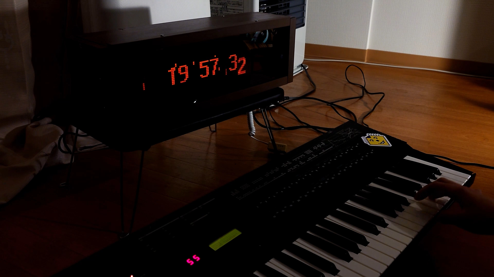
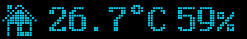

# PIS-OS

Personal Information System OS (formerly Plasma Information Screen OS).
(Not DOS, there is no disk in it! yet.)

A somewhat portable relatively-stylish pixel-art clock/weather station.



## A remark on the Morio Denki Plasma Display

**This display uses high voltage, which could be lethal!!**

The display comes from a bus or a train, supposedly. 

It has the following labels on the PCBs:

* Morio Denki 6M06056 (the 8085-based control board I wasn't able to get running)
* MD 16101DS-CONT82 06 (the actual framebuffer/drive board)
* MD-24T-ADT (2) 8201 (the boards on the plasma tube itself)

Despite using a standard "HDD" Molex 4-pin connector for the drive board power, it expects +160V on the pin where normally +12V would be supplied. Take care not to mix up the power supplies. (Plugging in +12V into the plasma board doesn't seem to damage it. Plugging in +160V into an HDD, on the other hand...)

More detailed info is available in the following articles:

* На русском: https://habr.com/ru/companies/timeweb/articles/808805/
* 日本語で: https://elchika.com/article/b9f39c29-64aa-42ab-8f73-e6e27a72bd0e/
* Demo video: https://youtu.be/D4MiHmhhjeQ

You can also read the quest I went through trying to get it to run "in real time" at [EEVBlog Forums](https://www.eevblog.com/forum/repair/trying-to-figure-out-if-a-vfd-displaydriver-is-broken-(74-series-logic)/).

## Available widgets

* Clock

    
    
* Indoor temperature

    
    
* Switchbot Meter temperature
* Weather (via [OpenWeatherMap](https://openweathermap.org/))
    
    

* Weather Effect (raining and thunder on idle screen when rain/thunderstorm outside)
    
    

* Word of the Day (via [Wordnik](https://wordnik.com/))
    
    

* Foobar2000 (via [foo_controlverver](https://github.com/vladkorotnev/foo_controlserver/tree/fix-streams))
    
    
    
* Remaining sleep time (when using alarm app)
    
    

## Available apps

* Idle (home screen)
* Timer
    
    
    
* Stopwatch
    
    
* Alarm (Smart Wake Up on devices with motion sensor)
    
    
    
    
    
    *(blinking lights warning!)*
* Weighing Scale (via Wii Balance Board)
    
    
* Settings
    
    

## Available chime tones

**(All chime tones are covers adapted for single channel beeper by DJ AKASAKA)**

* Simple beep
* PC-98 Boot Chime
* Russ28 (Русь 28) Hourly Chime (poorly timed Beethoven's 5th Symphony)
* Some mid-2000s Shtrikh-M (Штрих-М) POS Boot chime
* [A.M. - Arise](https://youtu.be/cuOVP6pJ9Ww?t=264): [MIDI](helper/chimes/arise.mid)
* [Caramell - Caramelldansen](https://youtu.be/o6Zp4cW8w8A?t=51): [MIDI](helper/chimes/caramelldansen.mid)
* [BôA - Duvet](https://youtu.be/Uoox9fpmDP0) (simple version): [MIDI](helper/chimes/duvet.mid)
* [T-Square - Truth](https://youtu.be/FZaUPGjjA4c?t=77): [MIDI](helper/chimes/truth.mid)
* [Kosaki Satoru - Haruhi no Omoi](https://www.youtube.com/watch?v=KMKoyHKYSNk): [MIDI](helper/chimes/haruhi_no_omoi.mid)
* [WAVE and DRAX - When Present Is Past](https://modarchive.org/index.php?request=view_by_moduleid&query=140039): [MIDI](helper/chimes/when_present_is_past.mid)
* [Kawada Mami - Hishoku no Sora](https://www.youtube.com/watch?v=FNl1ud7KxtI): [MIDI](helper/chimes/hishoku.mid)
* [Hirano Aya - Bouken Desho Desho](https://www.youtube.com/watch?v=C337shIT9LI): [MIDI](helper/chimes/bouken.mid)
* [Magome Togoshi, Shinji Orito - Gentle Jena](https://www.youtube.com/watch?v=lR4dw_B423E): [MIDI](helper/chimes/gentlejena.mid)
* [OMEGA - Gammapolisz](https://www.youtube.com/watch?v=XCqdrQxMrxI): [MIDI](helper/chimes/gammapolisz.mid)
* [? - Like The Wind (TMMS)](https://www.youtube.com/watch?v=uYpkri8Kv2E): [MIDI](helper/chimes/like_the_wind.mid)
* [NightRadio - Waiting Freqs](https://www.youtube.com/watch?v=_0MBreuq94Y): [MIDI](helper/chimes/waiting_freqs.mid)
* [NightRadio - The Way](https://nightradio.bandcamp.com/track/the-way): [MIDI](helper/chimes/the_way.mid)
* [Dougal & Gammer — Guitar Hero](https://youtu.be/ID4pO9epHPA?t=89): [MIDI](helper/chimes/gtrhero.mid)
* [蜂屋ななし — シャボン](https://youtu.be/UHRlXm_tV8o?t=41): [MIDI](helper/chimes/syabon.mid)
* [Takeshi Abo — Gate of Steiner](https://www.youtube.com/watch?v=2Q9MqL83FeE): [MIDI](helper/chimes/steiner.mid)
* [deadballP — 永遠に続く五線譜](https://www.youtube.com/watch?v=p1sh68qk4Nk): [MIDI](helper/chimes/towa.mid)
* [Cream puff — Mermaid girl](https://youtu.be/AaUMvgfHpUo?t=16): [MIDI](helper/chimes/mermgrl.mid)
* [Brisk & Trixxy — Eye Opener](https://youtu.be/81QqHUpyBhg?t=83): [MIDI](helper/chimes/eye_opener.mid)
* [Hiroyuki Oshima - The Ark Awakes From The Sea Of Chaos](https://www.youtube.com/watch?app=desktop&v=cB7eevDk1s0): [MIDI](helper/chimes/ark.mid)
* [Timbaland - Give It To Me](https://youtube.com/watch?v=RgoiSJ23cSc) also known as [Skibidi Toilet](https://youtu.be/6dMjCa0nqK0): [MIDI](helper/chimes/skibidi_toilet.mid)
* [PinocchioP - God-ish (神っぽいな)](https://www.youtube.com/watch?v=EHBFKhLUVig): [MIDI](helper/chimes/kamippoina.mid)

MIDI to sequencer conversion tool (supports note events in one track only, track end event, and comment event): [midi_to_chime](helper/midi_to_chime.py)

8 bit 8 kHz wave to RLE sample conversion tool (not even reading the header, so very jank): [pwm.py](helper/pwm.py)

## Remote Control Server

There is a remote control server you can enable in settings for debugging remotely when uploading firmware via OTA, or using an emulator without any screen and buttons.

Also included is a [primitive client](helper/remote-control.py) that has pretty poor performance, but allows recording GIFs and taking screenshots. All of the screenshots and GIFs in this readme were made that way.

https://github.com/user-attachments/assets/b1d1ee7e-b5f3-4800-a475-d44ae876bf7e

### Usage

1. Enable "Remote Control Server" under Settings → Display.
2. Save and Restart PIS-OS
3. Run `python ./helper/remote-control.py <CLOCK-IP>` on your computer. Port 3939 must be accessible.

### Protocol

The protocol is very simple.

The control client sends a control packet to the clock via UDP:

```
{
    uint16_t magic = 0x3939;
    key_id_t pressed = (set bits of those keys that were pressed since last transaction);
    key_id_t released = (set bits of those keys that were released since last transaction);
}
```

After that the client should expect a UDP packet from the clock with the format:

```
{
    uint16_t magic = 0x8888;
    uint16_t display_width;
    uint16_t display_height;
    ... remainder: bitmap data in fanta buffer format
}
```

## System Requirements

The basic configuration without any bluetooth functionality (no Switchbot or Balance Board integration) seems to work just fine on an ESP32 WROOM. However to be less limited by RAM size in further features I've decided to make WROVER the requirement, so further versions are not guaranteed to run on WROOM.

## Predefined target devices

* `DEVICE_PLASMA_CLOCK`: a [clock](https://youtu.be/D4MiHmhhjeQ) that I built around a plasma screen from an old Japanese bus/train.
* `DEVICE_MICROPISOS`: a portable devkit for PIS-OS, using a 100x16 OLED from WinStar.

## Supported hardware and feature-flags

### Display (at least one required)

* Morio Denki 16101DS (see [below](#morio-denki-plasma-display-info), [driver](src/display//md_plasma.cpp), feature flag `HAS_OUTPUT_MD_PLASMA`)
* Winstar WEG010016A in 8-bit parallel mode ([driver](src/display/ws0010.cpp), feature flag `HAS_OUTPUT_WS0010`)

### Speaker (at least one required)

* Piezo speakers: *now with 1-bit DMA polyphony!* ([driver](src/sound/beeper.cpp), [music](src/sound/melodies.cpp), [sequencer](src/sound/sequencer.cpp))

### Haptics (WIP)

* Taptic Engine via 2N3904 transistor as an amp (WIP: wired in parallel with the speaker)

### Software flags

* `HAS_WORDNIK_API`: compile with the Word Of The Day service using [Wordnik API](https://developer.wordnik.com/). This requires SSL, so bloats the firmware size significantly.
* `HAS_BLUETOOTH_LE`: automatically set on ESP32. Required for Switchbot-over-BLE. Uses Arduino-BLE and increases firmware size significantly.
* `HAS_OTAFVU`: OTA updates via ArduinoOTA. Currently disabled due to partition size constraints from the above.

### Thermal sensors

* AM2322 over IIC ([driver](src/sensor/am2322.cpp), feature flag `HAS_TEMP_SENSOR`)
* Switchbot Meter over BLE (unstable, [driver](src/sensor/switchbot/api.cpp), feature flag `SWITCHBOT_METER_INTEGRATION`, needs extra ram of a WROVER module)

### Motion sensors

* Any which provides logic H when motion found, logic L when not found ([driver](src/sensor/motion.cpp), feature flag `HAS_MOTION_SENSOR`)

### Light sensors

* Opto-resistor in voltage divider mode ([driver](src/sensor/light.cpp), feature flag `HAS_LIGHT_SENSOR`)

### HID

* Keypad/D-Pad. Set feature flag `HAS_KEYPAD` and define `const keypad_definition_t HWCONF_KEYPAD` in the device definition. [Driver](src/input/keypad.cpp)
* Touch plane. E.g. a faceplate with touch sensitive arrow keys to work in place of a D-pad. Set feature flag `HAS_TOUCH_PLANE` and define `const touch_plane_definition_t HWCONF_TOUCH_PLANE` in the device definition. [Driver](src/input/touch_plane.cpp)

### Others

* Wii Balance Board. Set feature flag `HAS_BALANCE_BOARD_INTEGRATION`. [Driver](src/service/balance_board.cpp), based upon [code by Sasaki Takeru](https://github.com/takeru/Wiimote/tree/d81319c62ac5931da868cc289386a6d4880a4b15), requires WROVER module

----

by Genjitsu Labs / akasaka, 2024.
